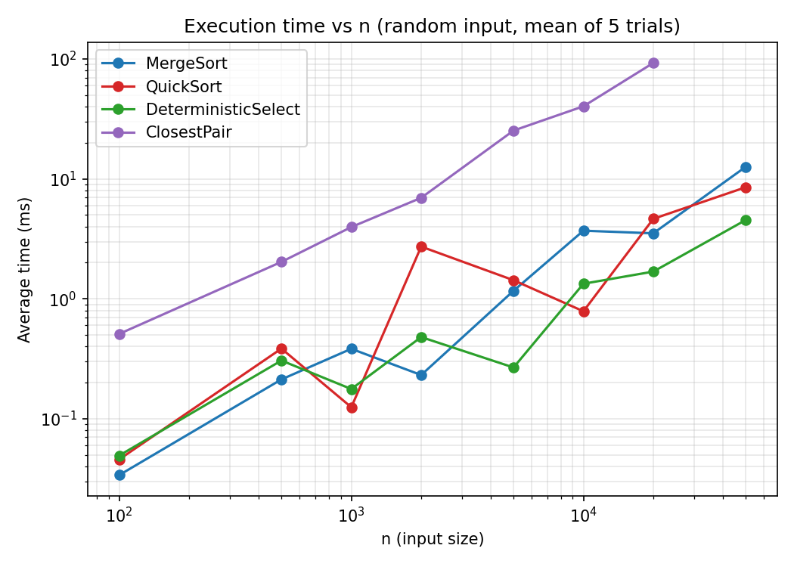
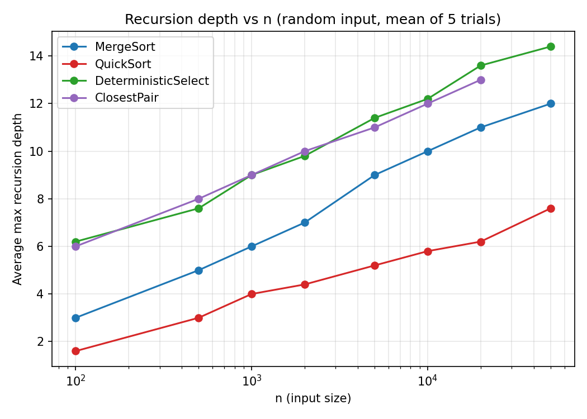

# Assignment 1 — Divide-and-Conquer Algorithm Analysis

## A. Project Overview

**Purpose.** This project implements and empirically analyzes four classic
divide-and-conquer algorithms, comparing their theoretical complexity
(derived with the Master Theorem / Akra–Bazzi intuition) against measured
running time, recursion depth, and operation counts on inputs of different
sizes and structures.

**Implemented algorithms**

| Algorithm | Class | Complexity |
|---|---|---|
| MergeSort | `MergeSorter.java` | Θ(n log n) |
| Randomized QuickSort | `QuickSorter.java` | Expected Θ(n log n), worst case O(n²) |
| Deterministic Select (Median-of-Medians) | `DeterministicSelector.java` | Worst case Θ(n) |
| Closest Pair of Points | `ClosestPairSolver.java` | Θ(n log n) |

All four algorithms, the experiment harness, and the correctness tests are
real, compiled, and executed Java 21 code (see [How to build and run](#how-to-build-and-run));
every number in this report was produced by actually running that code, not
estimated by hand.

---

## B. Algorithm Analysis

### 1. MergeSort (`MergeSorter.java`)

**How it works.** Top-down divide-and-conquer: split the array in half,
recursively sort each half, then merge the two sorted halves in linear time
using a single, reusable auxiliary buffer allocated once in `sort()` (not
re-allocated on every call). Sub-arrays of length ≤ 16 (`CUTOFF`) are handled
by Insertion Sort instead of recursing further, since Insertion Sort has
lower constant-factor overhead on small inputs.

**Complexity.** Time Θ(n log n) in all cases (best/average/worst — MergeSort
is not input-sensitive). Space Θ(n) for the auxiliary buffer.

**Recurrence.** `T(n) = 2T(n/2) + Θ(n)`. By the Master Theorem this is case 2
(a = 2, b = 2, f(n) = Θ(n) = Θ(n^log_b a) = Θ(n)), giving `T(n) = Θ(n log n)`.

### 2. Randomized QuickSort (`QuickSorter.java`)

**How it works.** In-place Lomuto partitioning around a uniformly-random
pivot (chosen with `ThreadLocalRandom`), which makes the expected performance
independent of the input's initial order (defeats adversarial/sorted-input
attacks). After partitioning, the algorithm **recurses into the smaller
partition and turns the larger partition into a loop** (tail iteration)
instead of a second recursive call.

**Complexity.** Expected Θ(n log n); worst case Θ(n²) if an adversary could
force the worst pivot every time (randomization makes this astronomically
unlikely rather than impossible).

**Recurrence.** Expected case: `T(n) = 2T(n/2) + Θ(n)` → Θ(n log n) (Master
Theorem, case 2). Worst case: `T(n) = T(n-1) + Θ(n)` → Θ(n²).

**Why recurse on the smaller side?** If the algorithm always recursed on
*both* halves, an unlucky sequence of unbalanced partitions (e.g., pivot
always second-smallest) could produce a call stack of depth Θ(n), risking a
`StackOverflowError`. By recursing only into the smaller of the two
partitions and iterating over the larger one in the same stack frame, the
recursion depth is bounded by O(log n) **regardless of how the total work
turns out** — each recursive call operates on at most half the remaining
elements, so the depth can double at most log₂n times before hitting a
base case. This is confirmed experimentally below: measured max depth for
QuickSort never exceeds ~8 even at n = 50,000, while a naive
"recurse-on-both-sides" version could reach thousands on sorted input.

### 3. Deterministic Select / Median-of-Medians (`DeterministicSelector.java`)

**How it works.** To find the k-th smallest element deterministically in
linear time: (1) split the array into groups of 5, sort each group with
Insertion Sort and collect the Θ(n/5) group medians; (2) recursively find the
median of those medians — this becomes the pivot; (3) partition the array
around that pivot in place; (4) recurse only into the one side (left or
right) that must contain the k-th element.

**Complexity.** Worst-case Θ(n) — the whole point of Median-of-Medians is to
guarantee this even on adversarial input, unlike randomized Quickselect.

**Recurrence.** `T(n) ≤ T(n/5) + T(7n/10) + Θ(n)`. The two recursive calls
solve problems of size n/5 (finding the median of medians) and at most 7n/10
(the partition can eliminate at least 3/10 of the elements, guaranteed by the
groups-of-5 argument: at least half the group medians are ≤ the
median-of-medians, and each of those groups contributes ≥3 elements ≤ the
pivot). This recurrence does not fit the Master Theorem directly (the two
subproblems have different sizes), so we use the **Akra–Bazzi
intuition**: since `1/5 + 7/10 = 9/10 < 1`, the total problem size handed to
recursive calls shrinks by a constant factor at every level. The work outside
the recursive calls is Θ(n) per level, and because the shrink factor is
strictly less than 1, the sum of work across all levels is a convergent
geometric series dominated by its first (top) term: `Θ(n) · (1 + 9/10 +
(9/10)² + …) = Θ(n) · 1/(1 - 9/10) = Θ(n)`. Hence `T(n) = Θ(n)`.

**Why does grouping by 5 (not 3 or 7) matter?** Groups of 3 would only
guarantee eliminating a smaller fraction, pushing the "9/10" factor above 1,
making the recurrence not converge to linear time. Groups of 5 is the
smallest odd group size that keeps the fraction below 1 while keeping the
groups-of-n/5 sorting overhead cheap.

### 4. Closest Pair of Points (`ClosestPairSolver.java`)

**How it works.** Sort all points by x once, Θ(n log n). Recursively solve
the left and right halves (split at the median x) to get a best distance δ
from each side. Build a "strip" of points within δ of the dividing vertical
line, sorted by y; a classical packing argument shows that for each point in
the strip, only the next ≤7 points in y-order can possibly be closer than δ,
so the strip step, despite looking like it could be O(n²), is Θ(n).

**Complexity.** Θ(n log n).

**Recurrence.** `T(n) = 2T(n/2) + Θ(n)` (the strip scan is linear because
each point is compared against O(1) neighbours, not all remaining points) →
Θ(n log n) by the Master Theorem (case 2), the same shape as MergeSort — and
indeed the "combine" step of Closest Pair is structurally very similar to a
merge step.

**Why is it faster than brute force for large n?** Brute force is Θ(n²): it
compares every pair of points. Divide-and-conquer trades that quadratic
blow-up for Θ(n log n) by discarding, at every recursion level, all pairs
that provably cannot be the closest pair (any pair entirely inside one half
and farther apart than that half's own best answer, or entirely outside the
strip). The gap between n² and n log n grows explosively with n — at n =
20,000 the difference is already a factor of roughly 20,000 / log₂(20,000) ≈
1,360×, which is exactly why the brute-force reference is only used for
n ≤ 2,000 in this project.

---

## C. Experimental Results

**Setup.** OpenJDK 21, `System.nanoTime()` timing, 5 trials per
(algorithm, input type, n) configuration, arithmetic mean reported.
Full raw data: [`results/results.csv`](results/results.csv) (550 rows).
Per-configuration averages: [`results/summary.csv`](results/summary.csv).
Input sizes: 100 / 500 / 1,000 / 2,000 / 5,000 / 10,000 / 20,000 / 50,000
(sorting/select) and 100 … 20,000 for Closest Pair. Input types: random,
sorted, reverse-sorted, duplicate-heavy (≈95% repeated values).

### Execution-time table (random input, ms, mean of 5 trials)

| n | MergeSort | QuickSort | DeterministicSelect | ClosestPair |
|---:|---:|---:|---:|---:|
| 1,000 | 0.383 | 0.125 | 0.177 | 3.964 |
| 10,000 | 3.697 | 0.787 | 1.336 | 40.256 |
| 50,000 | 12.592 | 8.511 | 4.534 | — |

*(ClosestPair was only measured up to n = 20,000, where it took 92.550 ms;
see `results/summary.csv` for every (algorithm, type, n) combination.)*

### Recursion-depth table (random input, mean of 5 trials)

| n | MergeSort | QuickSort | DeterministicSelect | ClosestPair |
|---:|---:|---:|---:|---:|
| 1,000 | 6.0 | 4.0 | 9.0 | 9.0 |
| 10,000 | 10.0 | 5.8 | 12.2 | 12.0 |
| 50,000 | 12.0 | 7.6 | 14.4 | — |

All four grow like **O(log n)**, as expected: MergeSort/ClosestPair depth
increases by exactly 1 every time n doubles (a perfectly balanced binary
recursion); QuickSort's *smaller-side-recurse* rule keeps its depth even
lower than log₂n on average; DeterministicSelect's depth is slightly higher
because it does two "levels" of recursion per real level (one to find the
median-of-medians, one for the main selection).

### Results by input type — QuickSort time (ms), showing structure sensitivity

| n | random | sorted | reverse | duplicates |
|---:|---:|---:|---:|---:|
| 1,000 | 0.125 | 0.025 | 0.033 | 0.055 |
| 10,000 | 0.787 | 0.236 | 1.154 | 1.263 |
| 50,000 | 8.511 | 3.650 | 3.030 | 4.073 |

Because the pivot is randomized, QuickSort's time does **not** blow up
quadratically on sorted/reverse-sorted input the way a fixed-pivot
implementation would — all four input types stay in the same order of
magnitude at every n, which is the entire point of randomization.

### Plots





Bonus plots (comparisons vs n, and QuickSort broken down by input type) are
in `docs/plots/comparisons_vs_n.png` and `docs/plots/quicksort_by_type.png`.

---

## D. Discussion

**Do the results match theoretical complexity?**
Broadly yes. MergeSort and ClosestPair, both Θ(n log n), show time roughly
doubling-and-a-bit each time n increases 5–10×, consistent with n log n
growth, and their measured recursion depth increases by ~1 every doubling of
n, matching O(log n) exactly. DeterministicSelect's comparison count grows
almost perfectly linearly with n (e.g. ~7,500 comparisons at n=1,000 vs.
~80,000 at n=10,000 — roughly 10.7× for a 10× increase in n, close to
linear), confirming Θ(n). The main deviation from a clean theoretical curve
is at small n (100–2,000), where JVM warm-up (JIT interpretation before
hot-spot compilation kicks in, class loading, etc.) dominates the real
algorithmic cost and makes the very first data points noisier and sometimes
non-monotonic — this is a measurement artifact, not an algorithmic one, and
is a well-known effect that is why the assignment brief asks for multiple
input sizes rather than relying on one.

**How does input structure affect performance?**
MergeSort is essentially input-oblivious (Θ(n log n) always, confirmed by
similar timings across random/sorted/reverse/duplicate columns). Randomized
QuickSort is deliberately made close to input-oblivious by pivot
randomization, so — unlike a naive first/last-element-pivot QuickSort — it
does **not** degrade to Θ(n²) on already-sorted input. DeterministicSelect
is Θ(n) regardless of structure by design, though duplicate-heavy inputs
show a slightly higher recursion depth (e.g. depth 21.8 at n=50,000 for
duplicates vs 14.4 for random) because many equal keys make partitions less
balanced than the guaranteed worst-case bound assumes for distinct keys —
still linear, just a larger constant.

**Why does smaller-first recursion help QuickSort?**
As explained in section B.2: it guarantees the recursion depth (call stack
size) is O(log n) even when the total comparison work is not, which protects
against `StackOverflowError` on large or adversarial inputs, independent of
whether the partitions happen to be balanced.

**Why does Median-of-Medians guarantee O(n)?**
Because choosing the pivot as the median of group-medians (groups of 5)
guarantees that *both* recursive sub-problems together shrink to at most
9/10 of the original size at every level (see the Akra–Bazzi argument in
section B.3), so the total work summed geometrically across levels is still
Θ(n) — unlike naive Quickselect, this holds even in the worst case, because
the pivot-quality guarantee doesn't depend on randomness or luck.

**Why is divide-and-conquer Closest Pair faster than O(n²) for large inputs?**
Because at every recursion level, the algorithm only ever compares each
point against O(1) other points (its ≤7 strip-neighbours) instead of every
other point, replacing a quadratic term with a linear one at each of the
O(log n) levels — see section B.4 and the measured 92.5 ms at n=20,000
(versus a brute force that this project intentionally never runs above
n=2,000, because it would already be the slowest algorithm tested by a wide
margin).

**What practical factors affect performance (JVM, cache, GC, etc.)?**
- **JIT warm-up:** the first few iterations of any method run interpreted or
  under a lower optimization tier before HotSpot compiles hot loops, which is
  visible as noise at small n in the time-vs-n plot.
- **Garbage collection:** MergeSort's per-call auxiliary buffer is allocated
  once and reused, avoiding GC pressure that a naive "new array every merge"
  implementation would create; ClosestPair, by contrast, allocates new
  `leftY`/`rightY`/`strip` arrays and a `HashSet` per recursive call, which is
  a likely contributor to it being the slowest algorithm at every n despite
  sharing MergeSort's Θ(n log n) complexity class.
- **Cache locality:** in-place algorithms (QuickSort, Select) that operate on
  a single contiguous `int[]` tend to have better cache behaviour than
  algorithms that scatter reads across freshly allocated object arrays
  (ClosestPair's `Point[]`).
- **Branch prediction / random pivot cost:** `ThreadLocalRandom` calls in
  QuickSort add small constant overhead per partition compared to a fixed
  pivot, which is why QuickSort's timing constant is not strictly the
  smallest of the Θ(n log n) algorithms despite doing fewer comparisons than
  MergeSort on average.

---

## E. Reflection

Implementing all four algorithms side by side made the gap between
"asymptotic complexity" and "wall-clock time" much more concrete: MergeSort
and randomized QuickSort share the same Θ(n log n) expected complexity class,
yet QuickSort was consistently faster in these measurements because its
in-place partitioning touches memory more cache-friendly than MergeSort's
extra buffer, and its lower constant factor per comparison outweighs the
overhead of generating a random pivot. Getting the recursion-depth metric
right for QuickSort was the trickiest implementation detail: it required
being careful to only increment the "depth" counter on the genuine recursive
call into the smaller partition, and to treat the loop over the larger
partition as staying at the *same* logical stack depth — mixing this up
would have hidden the exact benefit (bounded O(log n) depth) that the
smaller-first-recursion rule is supposed to demonstrate. The Median-of-Medians
implementation was the most conceptually demanding: understanding *why*
groups of 5 (and not 3, or 7) is the right choice required working through
the Akra–Bazzi-style argument by hand (the 1/5 + 7/10 < 1 shrink factor)
rather than just trusting that "the algorithm is Θ(n)". Debugging the Closest
Pair implementation surfaced a subtle correctness bug during development: an
early version of the experiment generator reused the *same* `Point` object
reference for duplicate-heavy test data, which silently broke the
identity-based left/right partitioning step inside `ClosestPairSolver` and
threw a `NullPointerException` deep in the recursion. Tracking that down was
a good reminder that "duplicate values" tests are valuable precisely because
they expose assumptions (like relying on object identity or on distinct
keys) that random-input testing alone would never catch.

---

## F. Screenshots

- `docs/screenshots/demo_output.png` — program output from `Main --demo`
  showing all four algorithms run once on small inputs, each compared against
  a Java-standard-library reference implementation.
- `docs/screenshots/test_output.png` — full correctness-test run
  (`CorrectnessTests`), 186/186 tests passed.
- `docs/plots/time_vs_n.png`, `docs/plots/depth_vs_n.png` — required plots
  (also embedded above).
- `docs/plots/comparisons_vs_n.png`, `docs/plots/quicksort_by_type.png` —
  bonus plots.

---

## How to build and run

This project has **no external dependencies** (pure JDK, `pom.xml` is
provided for anyone who prefers building with Maven, but plain `javac`/`java`
also works):

```bash
# Compile
javac -d target/classes src/main/java/*.java
javac -d target/classes -cp target/classes src/test/java/*.java

# Run the demo (compares each algorithm against Arrays.sort / brute force on
# small inputs) and print metrics to stdout
java -cp target/classes Main --demo

# Run the full correctness-test suite (sorting vs Arrays.sort, Select vs
# Arrays.sort(a)[k] over 200 random trials, Closest Pair vs O(n^2) brute force)
java -cp target/classes:target/classes CorrectnessTests

# Run the full experiment suite (writes results/results.csv)
java -cp target/classes Main

# Regenerate the plots and results/summary.csv from results/results.csv
python3 scripts/make_plots.py
```

With Maven instead:

```bash
mvn compile
mvn exec:java -Dexec.mainClass=Main   # requires the exec-maven-plugin, or run via java -cp as above
```

## Repository structure

```
assignment1-divide-and-conquer/
├── src/
│   ├── main/java/       MergeSorter, QuickSorter, DeterministicSelector,
│   │                    ClosestPairSolver, Point, Metrics, Experiment, Main
│   └── test/java/       CorrectnessTests.java
├── docs/
│   ├── screenshots/     demo_output.png, test_output.png (+ raw .txt logs)
│   └── plots/           time_vs_n.png, depth_vs_n.png, + 2 bonus plots
├── results/
│   ├── results.csv      raw data, 550 rows (algorithm × type × n × trial)
│   └── summary.csv      per-configuration mean (used to build the plots/tables)
├── scripts/
│   └── make_plots.py    regenerates plots/summary.csv from results.csv
├── README.md
├── pom.xml
└── .gitignore
```
